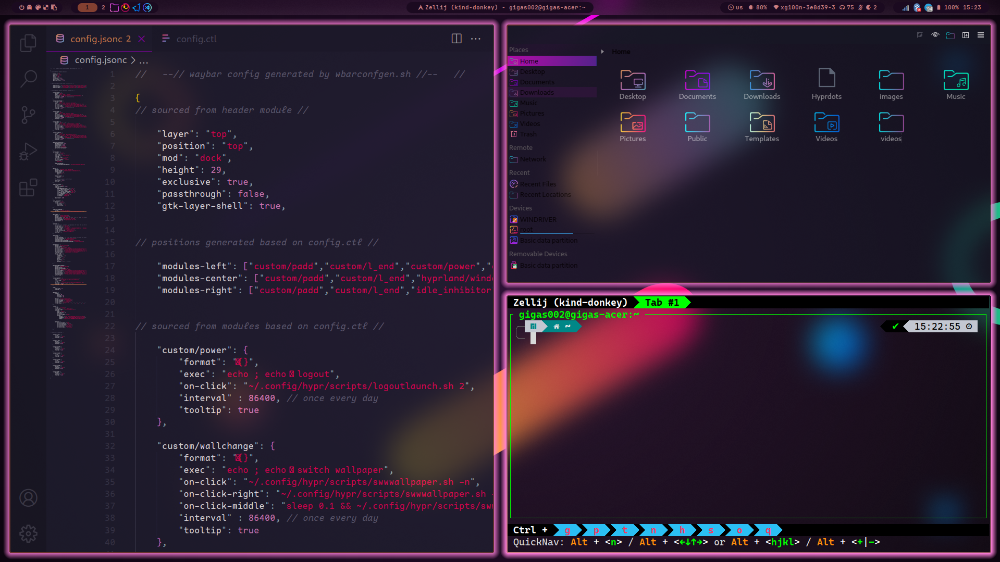

# hyprdots-sweet

An attempt to use the amazing gtk/kde sweet theme by [EliverLara](https://github.com/EliverLara) in [hyprland](https://github.com/hyprwm/Hyprland) via [hyprdots](https://github.com/prasanthrangan/hyprdots)

**Work in progress!**

For discussions, please refer to [this thread](https://github.com/prasanthrangan/hyprdots/discussions/653)

Some elements of this theme are inspired or a copy-paste (hope to get rid of these to use sweet colors) sections of the [Synth-Wave theme](https://github.com/prasanthrangan/hyprdots-mod)

## Installation

You'll need to clone the [hyprdots](https://github.com/prasanthrangan/hyprdots) repo first. Maybe a [hyprtdots-ctl](https://github.com/kRHYME7/Hyprdots-ctl) may useful too

After that, go into `Hyprdots/Scripts` and execute the `themepatcher`:

`/themepatcher.sh "Sweet" "https://github.com/gigas002/hyprdots-sweet" "EliverLara.sweet-vscode"`

## Current status

Seems to work correctly:

- gtk
- icons
- swww
- kvantum
- kitty
- cursors
- hypr
- waybar
- qtct -> works, but requires changes in future, see below

This package also provides the `sddm` and `firefox` themes, which you can enable manually (at least for now `hyprdots` doesn't automatically link these files during `themeinstall`). 

Packaging problems:

- ~~firefox -- packaged, but theme not applied~~
- vscode -- installable manually, but automatic install through `themepatcher.py` doesn't work ([theme](https://marketplace.visualstudio.com/items?itemName=EliverLara.sweet-vscode), [icons](https://marketplace.visualstudio.com/items?itemName=EliverLara.sweet-vscode-icons))
- ~~sddm -- can't confirm since I've always been using this theme with KDE Plasma and nothing changed for me with install~~

Incomplete:

- configs/qt5ct and qt6ct theme is a copy-paste from synthwave
- ~~ugly tray icons~~
- splashscreen if possible (probably need filing issue to `hyprland` or `hyprdots` if it's not)
