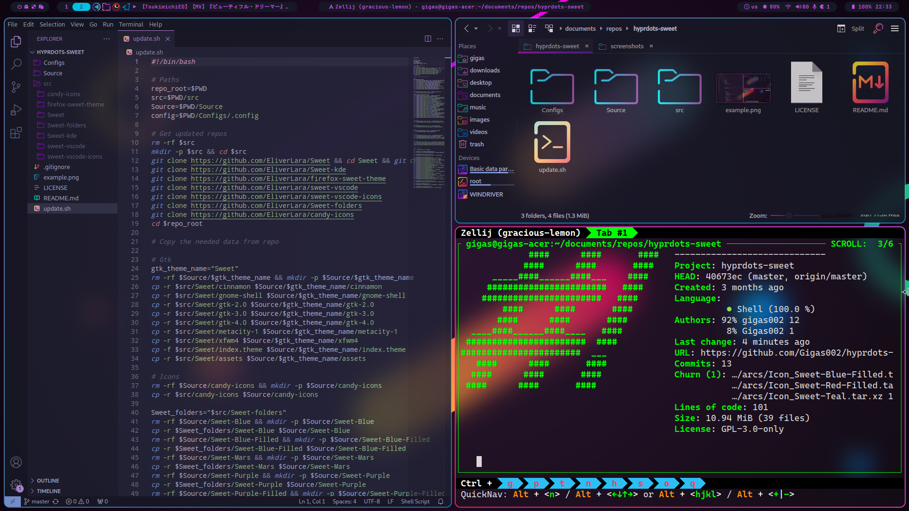

# hyprdots-sweet

An attempt to use the amazing gtk/kde sweet theme by [EliverLara](https://github.com/EliverLara) in [hyprland](https://github.com/hyprwm/Hyprland) via [hyprdots](https://github.com/prasanthrangan/hyprdots)

For discussions, please refer to [this thread](https://github.com/prasanthrangan/hyprdots/discussions/653)

Some elements of this theme are inspired by the [Synth-Wave theme](https://github.com/prasanthrangan/hyde-themes/tree/Synth-Wave)

## Installation

You'll need to clone the [hyprdots](https://github.com/prasanthrangan/hyprdots) repo first

After that, go into `Hyprdots/Scripts` and execute the `themepatcher`:

`/themepatcher.sh "Sweet" "https://github.com/gigas002/hyprdots-sweet" "EliverLara.sweet-vscode"`

As an alternative, you can use `hyde` package and run it through CLI:

`hyde theme patch "Sweet" https://github.com/gigas002/hyprdots-sweet`

### I don't want to use god-knows-who-built tarballs/I want to update tarballs

In this case you can clone this repo and run `update.sh` script in repo root. It will re-create the tarballs from latest changes in upstream repositories.
After that, just pass the path to repo on your disk to `themepatcher`/`hyde` instead of passing the URL
